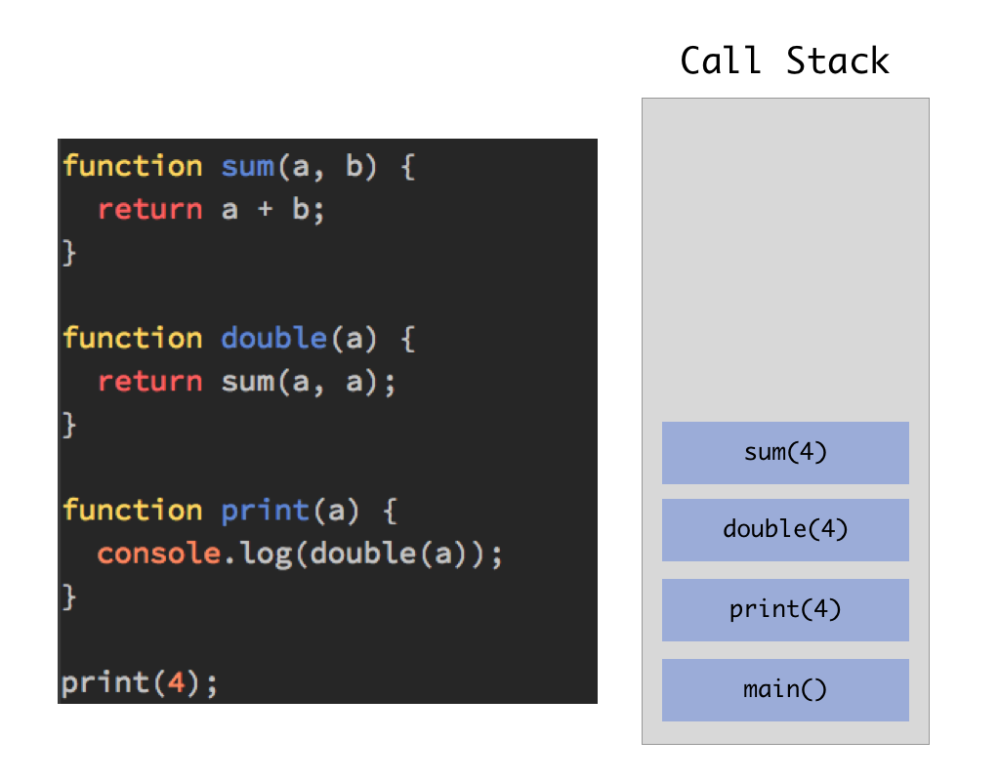
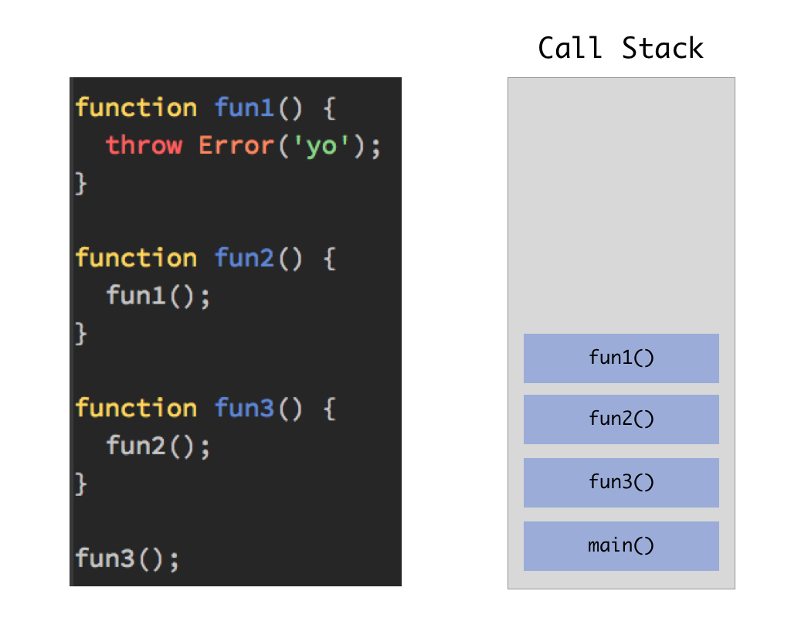
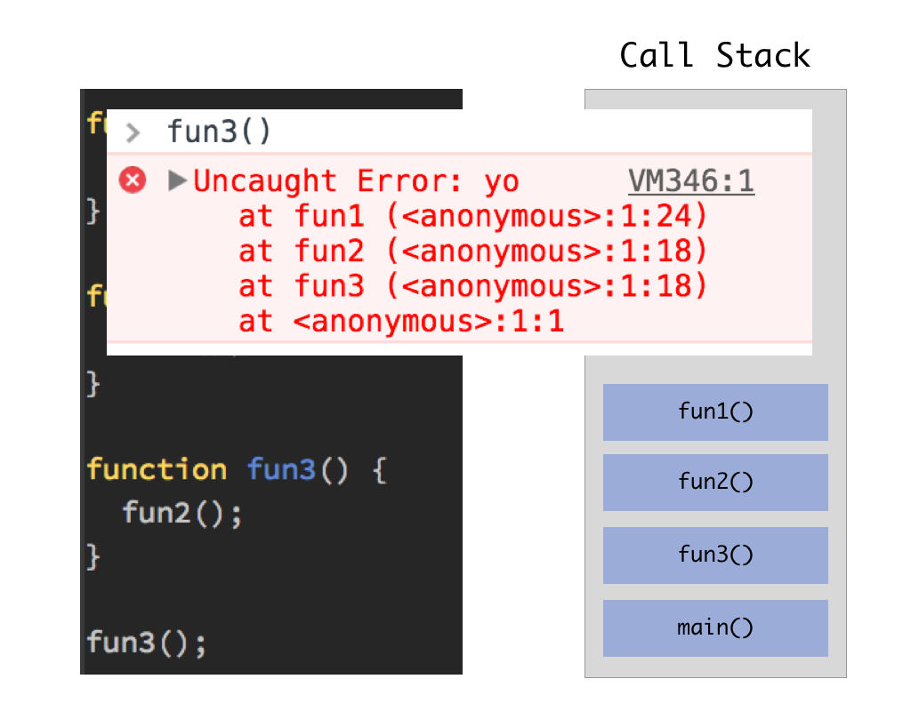
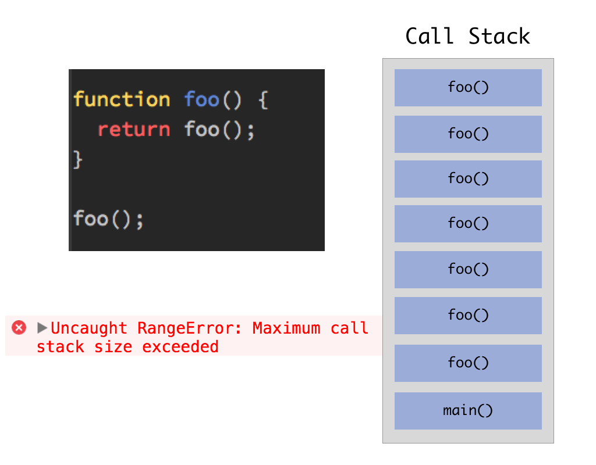
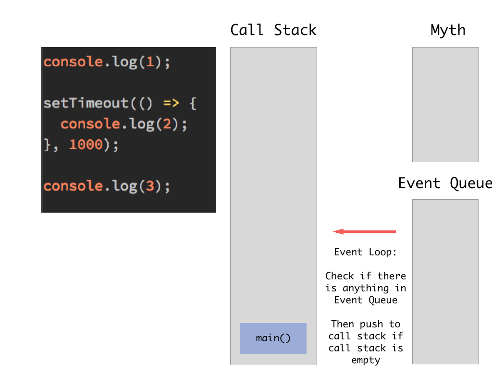
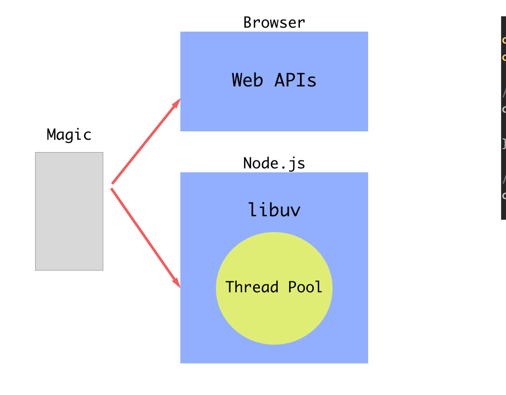

# How Javascript was designed

You might hear those topics about Javascript before:

* Single treaded.
* Call stack
* Event loop
* Asynchronous
* Concurrency Model

Here we will cover some basic knowledge about those five topics via a lifecycle of a Javascript program.

---

---

---

---

---

---

I highly recommand this video for more information: https://www.youtube.com/watch?v=8aGhZQkoFbQ
