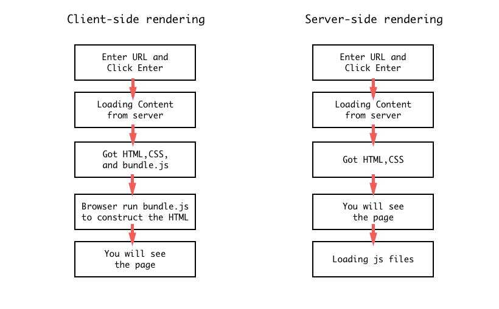

# React Server Side Rendering

Let's take a look at some concepts first.

Server-Side Rendering — SSR from here on — is the ability of a front-end framework to render markup while running on a back-end system.

Applications that have the ability to render both on the server and on the client are called **universal** apps, or **isomorphic** apps.

---

### What's the difference between client side rendering and SSR?

In Client-side rendering, your browser downloads a minimal HTML page. It renders the JavaScript and fills the content into it.

Server-side rendering, on the other hand, renders the React components on the server. The output is HTML content.



---

### Why SSR?

* SEO

Every website wants to appear in searches. Unfortunately, Search engine crawlers do not yet understand/render JavaScript. This means they see a blank page, no matter how helpful your site is.

* Improve performance

This is all about First User Interaction Time, or Initial Page Loading Time. This is the difference in time from when a user hits the URL to when they see content.

---

### Why not SSR?

* SSR can improve performance if your application is small. But it can also degrade performance if it is heavy.
* It increases response time (and it can be worse if the server is busy).
* It increases response size, which means the page takes longer to load.
* It increases the complexity of the application.

---

### How does SSR work in React?

* Get React component and generate HTML string in server side via `renderToString`.
* Send HTML to browser.
* Extract only the interaction part from React component, and add those code along with your HTML via `ReactDOM.hydrate()`.
* After the HTML and the client side Javascript loaded in your browser, the client side Javascript will find the right component for all the interaction parts.
* For real world problem, it will never be that easy especially when you try to add React Router and Redux in the SSR.
* There are a number of wonderful frameworks help you do SSR. [Next.js](https://nextjs.org/) is the best and the most popular one.

```js
// server
import express from 'express';
import path from 'path';

import React from 'react';
import {renderToString} from 'react-dom/server';
import Layout from './components/Layout';

const app = express();

app.use(express.static(path.resolve(__dirname, '../dist')));

app.get('/*', (req, res) => {
  const jsx = <Layout />;
  const reactDom = renderToString(jsx);

  res.writeHead(200, {'Content-Type': 'text/html'});
  res.end(htmlTemplate(reactDom));
});

app.listen(2048);

function htmlTemplate(reactDom) {
  return `
        <!DOCTYPE html>
        <html>
        <head>
            <meta charset="utf-8">
            <title>React SSR</title>
        </head>
        
        <body>
            <div id="app">${reactDom}</div>
            <script src="./app.bundle.js"></script>
        </body>
        </html>
    `;
}
```

---

```js
// client

import ReactDOM from 'react-dom';
import Layout from './components/Layout';

const app = document.getElementById('app');
ReactDOM.hydrate(<Layout />, app);
```
