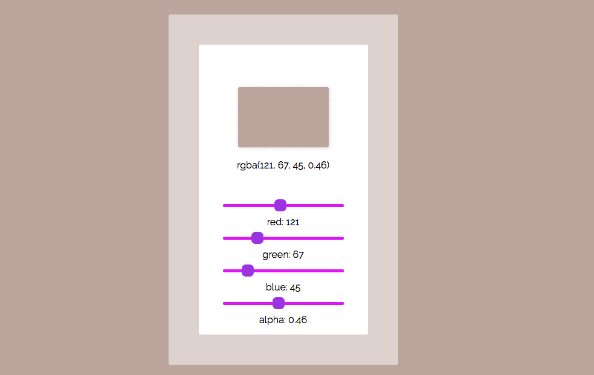

# Homework 10

In this homework we are going to build a color picker using React.

Demo:

---

### Requirements

* You need to have four sliders (or inputs) to control four parameters of the color: red, green, blue and alpha.
* Once you change the sliders (or inputs), you can see the background color changing based on the current parameters.
* You don't have to follow the UI in the example, but make your work look good.
