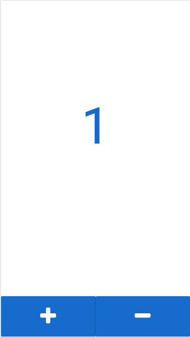

# Homework 2

Build simple counter web application using React:

* You need to have a UI to show the current number in the counter
* You need to have a button, which will increase the counter by after clicking.
* You need to have a button, which will decrease the counter by after clicking.

The basic page should be like this:

![Example](../diagram/dist/react-counter.png

If you want to spend more time on styling and css, you can also make something like this:

