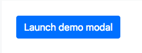
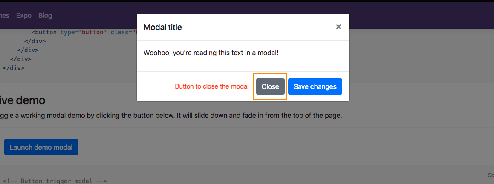

# Homework 7

In this homework we are going to design and implement a React Component for modal.

A modal (or dialog) is one the most common used UI in website. Usually there is a button to trigger the modal:



Once you click the button, you will see a dialog with a button to close the modal, while there will be an overlay in the background:



Your task is to build a React Component called `Modal` with requirements listed below:

* In order to use the `Modal` component, you need to import `Modal` component in your `App` component and use it as `<Modal />`.
* Your `Modal` componnet should render a button to trigger the modal by default.
* Your `Modal` component needs to accept different props:
  * String `buttonText` will decide what the text should be rendered on the button which will trigger the modal.
  * String `cancelButtonText` will decide what the text should be rendered on the button which can close the modal inside the modal dialog.
  * React Element `content` is what you want to see in the modal dialog.
  * Number `width` is the width of the modal dialog.

For exmaple, in our `App` component:

```js
import Modal from '...';

class App extends Component {
  render() {
    const content = <p>Hello Modal</p>;
    return (
      <Modal
        buttonText="Open"
        cancelButtonText="Go Back"
        content={content}
        width={400}
      />
    );
  }
}
```

First of all you will see a button with text "Open" in the website. When you click the button, a 400px wide dialog will be opened with the content `<p>Hellow Modal</p>` and a button with text "Go Back" where you can click to close the modal.

Please note that usually if a React Component requires different props, most of those props should be optional. In the other word, if you don't pass the props to the component, it should has some default values.
