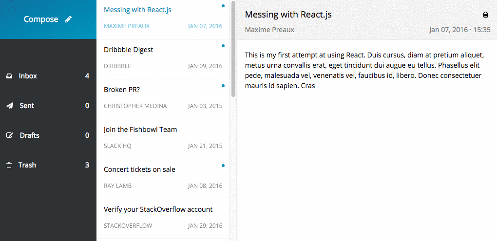

# Homework 8

In this homework we are going to build a simple email client.

You need to get the data for the email client from:

`GET http://api.haochuan.io/emails`

---

### Requirements

* Emails are separated by `tag`: Inbox, Send, Drafts, or Trash. For every single `tag`, you need to show the number of emails in each `tag`. Note that for Inbox tag, the number should be the count of unread emails instead of the count of all emails.
* When there is nothing in a specific tag, you need to show user a message to indicate that the current tag is empty.
* When clicking every single `tag`, you need to show a list of emails that belong to that `tag`.
* When click every single email, you need to show `subject`, `from`, `to`, `time`, `message`, as well as a button to delete email.
* When click the delete button to delete a email, that email will be moved into Trash tag. Emails in trash tag should not have the delete button.
* You don't have to follow the UI in the example, but make your work look good.
* You don't need to do the "Compose" part for this homework.
