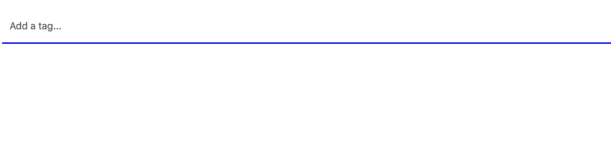

# Homework 9

In this homework we are going to build a tag input using React.

Demo:

---

### Requirements

* You can type on the input box and then press "Enter" key on your keyboard to create a tag.
* Every tag has a button ('X') to remove itself.
* You don't have to follow the UI in the example, but make your work look good.
