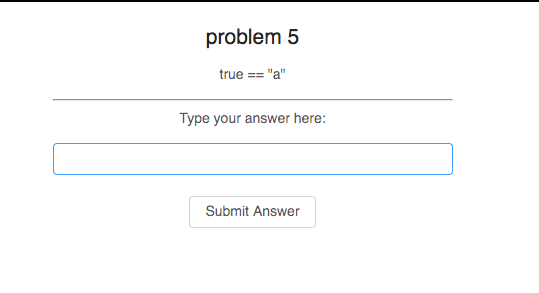

# Homeword Five

This is a follow up for homework four.

* In `/:problemId` where you will show problem detail on the page, create a input box to let the user type the answer, and also a button for the user to submit the answer, like:

* User need to type `true` or `false` and then submit the answer. You need to hit `POST http://api.haochuan.io/oj/problems/:problemId/solution` with a post body `{answer: true(or false)}` to verify if the answer is correct. You will receive a json like `{pass: true(or false)}` to indicate if the answer is correct.

* Show corresponding message to the user to indicate if the answer is correct or not.
