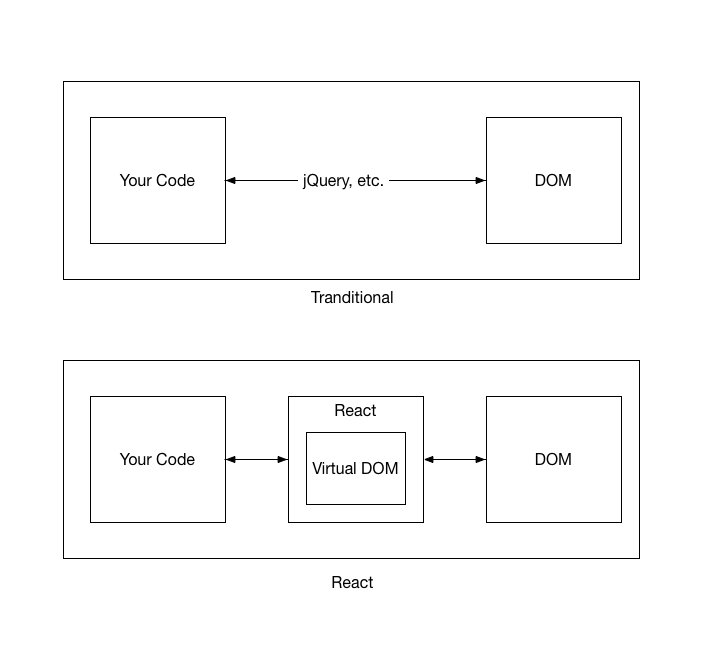

# Virtual DOM

### What is DOM?
DOM stands for Document Object Model. It’s a way of representing a structured document via objects. It is cross-platform and language-independent convention for representing and interacting with data in HTML, XML, and others. Web browsers handle the DOM implementation details, so we can interact with it using JavaScript and CSS. We can search for nodes and change their details, remove one and insert a new one.

### DOM Problem
The main problem is that DOM was never optimized for creating dynamic UI.
We can work with it using JavaScript and libraries like jQuery (thank God we have it). But jQuery and others did little to solve performance issues. Think about modern social networks like Twitter, Facebook or Pinterest. After scrolling a little bit, the user will have tens of thousands of nodes. Interact with them efficiently is a huge problem. Try to move a 1000 divs 5 pixel left for example. It may take more than a second. It’s a lot of time for the modern web. You can optimize the script and use some tricks, but in the end, it’s a pain to work with huge pages and dynamic UI.

### Virtual DOM
Rather than touching the DOM directly, we’re building an abstract version of it. That’s it. We working with some kind of lightweight copy of our DOM. We can change it as we want and then save to our real DOM tree. While saving we should compare, find difference and change (re-render) what should be changed.

Virtual DOM is a technique and set of libraries / algorithms that allow us to improve front end performance by avoiding direct work with DOM and work only with lightweight JavaScript object that mimics the DOM tree.

What makes it really fast are:

* Efficient diff algorithms.
* Batching DOM read/write operations.
* Efficient update of sub-tree only.

